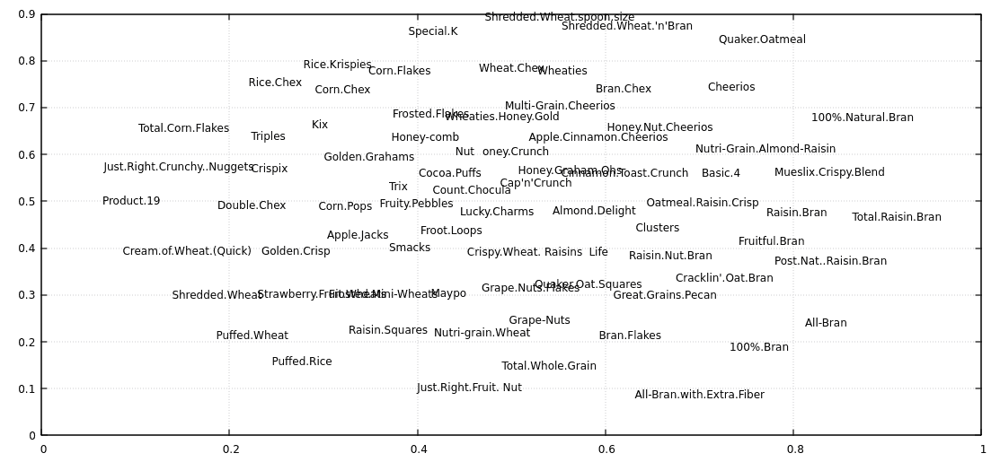

# csvdimreduce

Simple algorithm for dimensionality reduction based on CSV files. It reads one CSV file, runs the algorithm based on columns you speicfy and outputs augumented CSV which additional coordinate columns. Those coordinates should have values from 0 to 1. Input data should be pre-normalized.

Rows which have similar values in columns you specify should be appear close to eather other.

Note the algorirm has quadratical space and time complixity in number of rows.

## Algorithm

1. For each pair of input rows, calculate the repelling force between them. The force is [L1 distance](https://en.wikipedia.org/wiki/Taxicab_geometry) between values in selected columns plus a small constant.
2. Add specified number (N) of additional columns with random values from 0 to 1.
3. Interpret rows as particles in N-dimensional space that are attracted to (0.5, 0.5, ..., 0.5) point, but repel from each other. Run it for specified number of iterations.
4. Optionally continue running the particle simulation while increasing the "centripetal" force for some of the dimentions to "squeeze" the point cloud into a flatter shape. This is recommended if you want to assign 1- or 2-dimentional coordinates to your rows. "Squeezed" dimentions would still appear in the output, but are expected to have values `0.5`.

I don't know how this algorithm is formally called.


## Example 1

Using [80 cereals](https://www.kaggle.com/datasets/crawford/80-cereals/) dataset.

```
$ wget https://gist.github.com/kcoltenbradley/1e8672cb5dff4a4a5e8dbef27ac185f6/raw/9a311a88d5aabdfddd4c9f0d1316612ec33d3d5e/cereal.csv

$ csvdimreduce 4:13 4 -S 2 -N cereal.csv -o output.csv

$ xsv table output.csv | head -n5 | cut -c 1-70
coord1  coord2  coord3  coord4  Cereal Name                  Manufactu
0.7637  0.1889  0.5000  0.5000  100%_Bran                    Nabisco
0.8742  0.6806  0.5000  0.5000  100%_Natural_Bran            Quaker Oa
0.8334  0.2408  0.5000  0.5000  All-Bran                     Kelloggs
0.7007  0.0888  0.5000  0.5000  All-Bran_with_Extra_Fiber    Kelloggs

$ cat output.csv | tail -n +2 | tr ',_' ' .' | awk '{print $1, $2, $5}' | feedgnuplot --domain --style 0 'with labels' --rangesize 0 2
```

.


## Example 2

Let's "reduce" somewhat regular onedimensional data to 2 dimensions (using two another temporarly dimensions in process) and visualize the algorithm steps.

<details><summary>Code</summary>

```
$ seq 0 100 > q.txt
$ seq 50 150 >> q.txt
$ seq 300 350 >> q.txt

$ csvdimreduce  --save-each-n-iters 1 --delimiter ' ' --no-header 1 4 -S 2 -F 0.28 ../q.txt -o ../w.txt -n 1000 -r 0.001 -c 10 -C 200 --squeeze-rampup-iters 500

$ mkdir beta
$ render2d_a() { awk '{print $1,$2,$5}' "$1" | feedgnuplot --xmin 0 --xmax 1 --ymin 0 --ymax 1 --domain --style 0 'with labels' --rangesize 0 2 --hardcopy beta/a."$1".png --terminal 'png size 960,1080' &> /dev/null; }
$ render2d_b() { awk '{print $3,$4,$5}' "$1" | feedgnuplot --xmin 0 --xmax 1 --ymin 0 --ymax 1 --domain --style 0 'with labels' --rangesize 0 2 --hardcopy beta/b."$1".png --terminal 'png size 960,1080' &> /dev/null; }
$ export -f render2d_a render2d_b
$ parallel -j12  -i bash -c 'render2d_a {}' -- debug0*csv
$ parallel -j12  -i bash -c 'render2d_b {}' -- debug0*csv
$ ffmpeg -i beta/a.debug'%05d'.csv.png -i beta/b.debug'%05d'.csv.png -filter_complex '[0]pad=1920:1080[a]; [a][1]overlay=960'  -g 500 -pix_fmt yuv420p -c librav1e -qp 182 -speed 1 -y seq.webm
```

</details>

[seq.webm](https://github.com/vi/csvdimreduce/assets/173219/36dcbd79-99f3-4c01-be56-fd25a9f2a2d2)


## Installation

Download a pre-built executable from [Github releases](https://github.com/vi/csvdimreduce/releases) or install from source code with `cargo install --path .`  or `cargo install csvdimreduce`.

## CLI options

<details><summary> csvdimreduce --help output</summary>

```
csvdimreduce

ARGS:
    <columns>
      List of columns to use as coordinates. First column is number 1. Parsing support ranges with steps like 3,4,10:5:100.
      See `number_range` Rust crate for details.
      Use `xsv headers your_file.csv` to find out column numbers.

    <n_out_coords>
      Number of output coordinates (new fields in CSV containing computed values)

      This includes temporary coordinates used for squeezing (-S).

    [path]
      Input csv file. Use stdin if absent.

OPTIONS:
    --save-each-n-iters <n>

    --no-header
      First line of the CSV is not headers

    --no-output-header
      Do not output CSV header even though input has headers

    --delimiter <delimiter>
      Field delimiter in CSV files. Comma by default.

    --record-delimiter <delimiter>
      Override line delimiter in CSV files.

    -o, --output <path>
      Save file there instead of stdout

    --random-seed <seed>
      Initial particle positions

    -w, --weight <column_number>
      Use this column as weights

    -n, --n-iters <n>
      Basic number of iterations. Default is 100.
      Note that complexity of each iteration is quadratic of number of lines in CSV.

    -r, --rate <rate>
      Initial rate of change i.e. distance the fastest particle travels per iteration.
      Default is 0.01.

    --inertia-multiplier <x>
      Apply each movement multiplpe times, decaying it by this factor. Default is 0.9.

    -R, --final-rate <final_decay>
      Ramp down rate of change to this value at the end.

    -c, --central-force <f>
      Attract particles' coordinates to 0.5 with this strenght (relative to average inter-particle forces).

    -F, --same-particle-force <f>
      Additional repelling force between particles (even those with the same parameters). Default is 0.2

    -S, --retain_coords_from_squeezing <n>
      After doing usual iterations, perform additional steps to \"flatten\" the shape into fewer dimension count (squeeze phase).
      Specified number of coodinaes are retained. For others, the `-c` central force is crancked up to `-C`, so they
      (should) become flat \"0.5\" in the end.
      This produces better results compared to just having that number of coordinates from the beginning.

    --squeeze-rampup-rate <rate>
      Use this `-r` rate when doing the squeeze phase.

    --squeeze-rampup-iters <n>
      User this number of iterations of the first phase of squeezing phase.
      This applies to each squeezed dimension sequentially.

    -C, --squeeze-final-force <f>
      This this central force for the squeezed dimensions.
      The force is gradually increased from `-C` to this value during the rampup phase.

    --squeeze-final-initial-rate <rate>
      Override `-r` rate for the second phase of squeezing. It decays with `-d` each iteration.

    --squeeze-final-iters <n>
      Number of iterations of the second phase of squeezeing (where central force no longer changes, just to increase precision)

    --warmup-iterations <n>
      Gradually increase rate from zero during this number of iterations. Defaults to 10.

    --debug
      Print various values, including algorithm parameter values

    -N, --normalize
      Automatically normalize the data

    -h, --help
      Prints help information.

```
</details>

## See also

* [pcacsv](https://github.com/vi/pcacsv) - CLI tool with similar UX, but other, linear algorithm.
